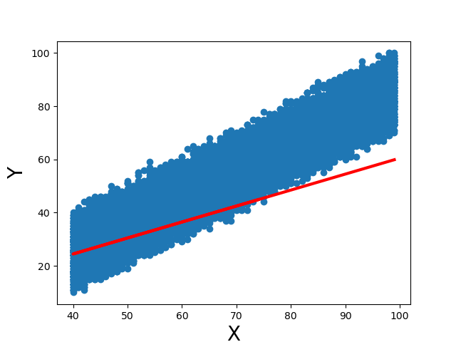
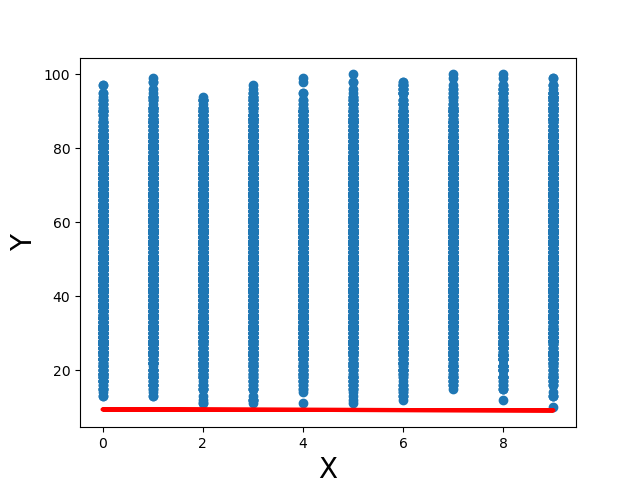

# Simple Linear Regression

Simple linear regression algorithm implemented from scratch.

The algorithm has been tested on a dataset with 4 features. 5 models were trained; 4 with one feture from the data each, and the fifth with a compound feature.

## Data Features

- ### Hours Studied

  The total number of hours a student spent studying.

- ### Previous Scores

  The scores obtained by the student in previous tests.

- ### Sleep Hours

  The average number of hours of sleep the student had per day.

- ### Sample Question Papers Practiced

  The number of sample question papers the student practiced.

- ### Performance Index

  A measure of the overall performance of the student, likely on a scale of 0 to 100.

## Summary of Results

| Model # | X variable             | Mean Square Error |
| ------- | ---------------------- | ----------------- |
| 1       | Hours Studied          | 2685.83           |
| 1       | Previous Scores        | 282.59            |
| 3       | Sleep Hours            | 796.47            |
| 4       | Sample Question Papers | 2485.52           |
| 5       | Sum of all features    | 128.42            |

## Choosing Different Features to Train The Model

- ### Model 1 - Hours Studied

  

  The feature shows a very weak linear relationship with the target. It also appears to be discrete.

- ## Model 2 - Previous Scores

  

  Out of all the features, this feature shows the strongest linear relationship with the target.

- ## Model 3 - Sleep Hours

  

  The feature does not show a linear relationship with the target. It also appears to be discrete.

- ## Model 4 - Sample Question Papers

  

  The feature does not show a linear relationship with the target. It also appears to be discrete.

- ## Model 5 - Sum of all features

  

  This compound feature is the sum of all the original features. It shows a stronger linear relationship than the best original feature (previous scores).

# Conclusion:

The compound feature (given by adding all the original feature values) appears to be the best at predicting the performance index. This is evident by the fact that the model that used it yielded the minimum error.
