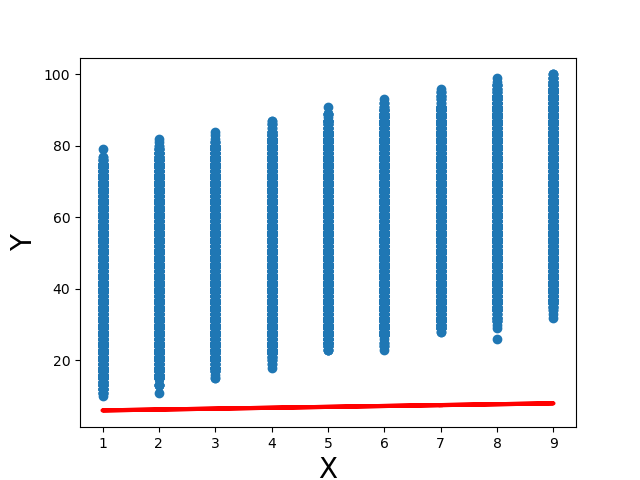
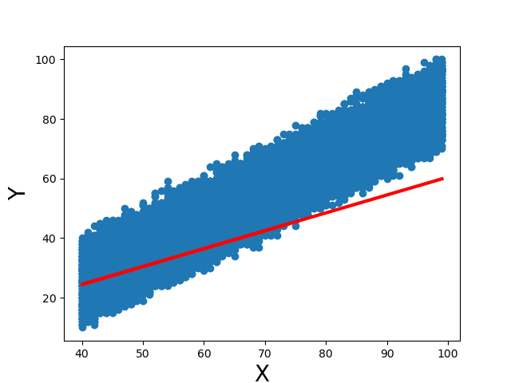
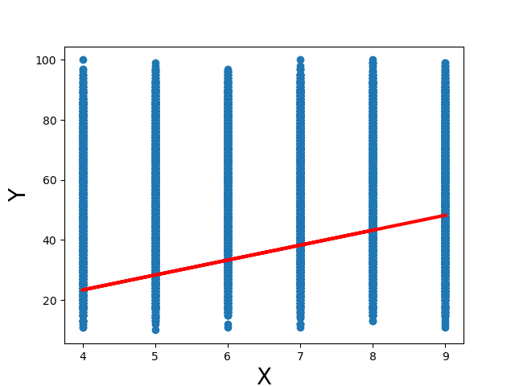
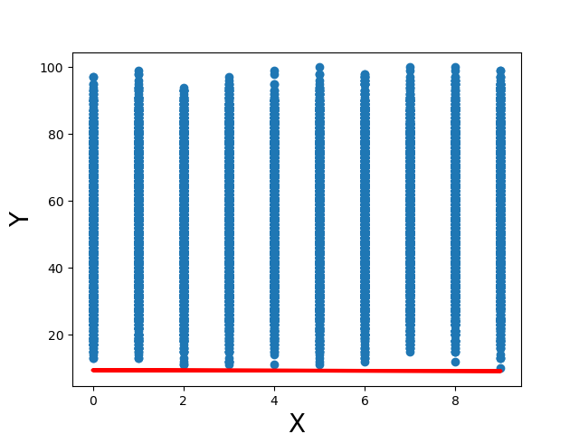
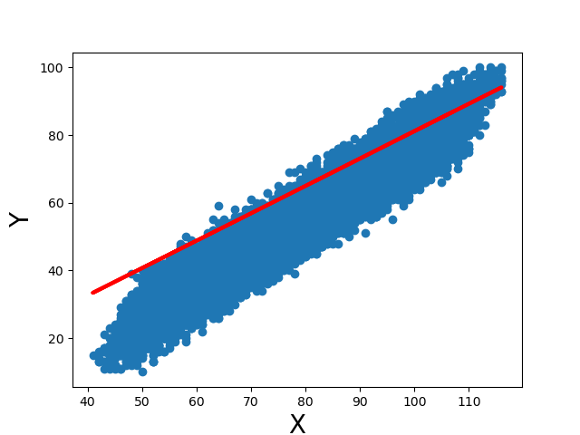

| Model # | X variable             | Mean Square Error |
| ------- | ---------------------- | ----------------- |
| 1       | Hours Studied          | 2685.83           |
| 1       | Previous Scores        | 282.59            |
| 3       | Sleep Hours            | 796.47            |
| 4       | Sample Question Papers | 2485.52           |
| 5       | Sum of all features    | 128.42            |

## Model 1 - Hours Studied

The feature shows a very weak linear relationship with the target. It also appears to be discrete.

## Model 2 - Previous Scores

Out of all the features, this feature shows the strongest linear relationship with the target.

## Model 3 - Sleep Hours

The feature does not show a linear relationship with the target. It also appears to be discrete.

## Model 4 - Sample Question Papers

The feature does not show a linear relationship with the target. It also appears to be discrete.

## Model 5 - Sum of all features

This compound feature is the sum of all the original features. It shows a stronger linear relationship than the best original feature (previous scores).

# Conclusion:

The best variable to use to predict the performance index is the sum of all the given variables. This is evident by the fact that the model that used it yielded the minimum error.
